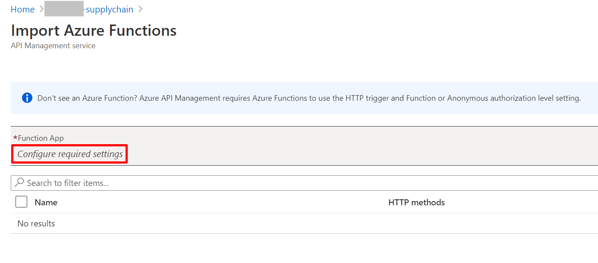

The reference implementation contained in this repository complements the following [article](https://medium.com/southworks/smart-contracts-in-the-retail-industry-59cb4c985ec1).

# How to run our solution

## Requirements

To run our solution you will need:
- [Azure subscription](https://azure.microsoft.com/en-us/free/search/?&ef_id=Cj0KCQiAqdP9BRDVARIsAGSZ8AmMH-H-3j6MANEfaA5O942gf1MjJXsKnzKAHuyWXu1RbfAq-ihDzpMaAmC_EALw_wcB:G:s&OCID=AID2100131_SEM_Cj0KCQiAqdP9BRDVARIsAGSZ8AmMH-H-3j6MANEfaA5O942gf1MjJXsKnzKAHuyWXu1RbfAq-ihDzpMaAmC_EALw_wcB:G:s&gclid=Cj0KCQiAqdP9BRDVARIsAGSZ8AmMH-H-3j6MANEfaA5O942gf1MjJXsKnzKAHuyWXu1RbfAq-ihDzpMaAmC_EALw_wcB) (a free trial is available)
- [VSCode](https://code.visualstudio.com/download)
- [PowerShell](https://docs.microsoft.com/en-us/powershell/scripting/install/installing-powershell?view=powershell-7.1)
- [Azure CLI](https://docs.microsoft.com/en-us/cli/azure/install-azure-cli)
- [Node.js](https://nodejs.org/en/download/)
- [Truffle](https://www.trufflesuite.com/docs/truffle/reference/truffle-commands)
- A Mnemonic passphrase

In VS Code, we used the following required extensions:
- [Blockchain Development Kit for Ethereum](https://marketplace.visualstudio.com/items?itemName=AzBlockchain.azure-blockchain)
- [solidity](https://marketplace.visualstudio.com/items?itemName=JuanBlanco.solidity)
- [Azure Functions](https://marketplace.visualstudio.com/items?itemName=ms-azuretools.vscode-azurefunctions)

## Steps to reproduce our solution
1. Clone the repo
2. Create essential Azure Resources
3. Deploy Azure Functions and setup settings
4. Deploy Smart Contracts
5. Import Function Apps into Azure API Management

Optional, if you want to get email notifications:

6. Deploy Logic Apps
7. Create Data Manager Application

## 1. Cloning the repo

To clone the repo, just run this snippet in a directory of your preference:

```bash
git clone git@github.com:southworks/azure-blockchain-supply-chain.git
```

## 2. Create essential Azure Resources

First, make sure that you have [Azure CLI](https://docs.microsoft.com/en-us/cli/azure/install-azure-cli) installed.

Then follow these steps:

1. Login into your Azure account: 
    ```bash 
    az login
    ```

2. Create the Resource Group where all services will be deployed:
    ```bash
    az group create -l <region> -n <resourceGroupName>
    ```
    E.g.: `az group create -l centralus -n supplychain`
    > NOTE: Use only lowercase letters in the RG name and avoid hyphens (-) or undercores (_). The RG name is later used to name some services.

3. Create the basic Azure services for our solution. You need to run the following line that will run an ARM Template. If you want to customize parameters, edit those in the `template.core.parameters.json` file. This ARM Template will create three Function Apps with their storage and App Insights, and it will create an Azure Blockchain Service instance with a blockchain, a CosmosDB collection, an Event Grid Topic and an API Management instance:
    ```bash
    az deployment group create --resource-group <resourceGroupName> --template-file ./arm/template.core.json --verbose
    ```
    > NOTE: Creation of Azure API Management and Cosmos DB could take ~20 minutes.

## 3. Deploy Azure Functions and setup settings

Once your resources are created, deploy the Azure Functions [projects](./azureFunctions). 

To deploy [Azure Functions](./azureFunctions) follow these steps:
- Open each Azure Function project in a separate VS Code instance (`consumer`, `retailer` and `stock`).
- Press `F1` and find *Azure Functions: Deploy to Function App*.

Then, go to each Function App in [Azure Portal](https://azure.microsoft.com/en-us/features/azure-portal/) and update PRIVATE_KEY and RPC_ENDPOINT settings (see [documentation](https://docs.microsoft.com/en-us/azure/azure-functions/functions-how-to-use-azure-function-app-settings#settings), also check these links about how to get the [private key](#get-the-private-key) and [rpc endpoint](#get-the-rpc-endpoint) values).

To retrieve the RPC Endpoint of the blockchain, the mnemonic passphrase and your private key follow these guides:

### Get the RPC Endpoint

Using the VSCode extension "Blockchain Development Kit for Ethereum":

1. Under Blockchain Networks in Visual Studio Code, click *connect to a network* and select the network you want to use.   
Next click on *Azure Blockchain*, you will then get the member's transaction node.  

2. Select Copy RPC Endpoint Address. 

3. The RPC endpoint is copied to your clipboard.

    

### How to create a mnemonic passphrase

To get a mnemonic passphrase follow these steps:
- Go to [https://iancoleman.io/bip39/](https://iancoleman.io/bip39/) or any other generator of your preference and generate a twelve words passphrase.
- Create a `mnemonic.env` file in root folder of this project.
- Paste the mnemonic passphrase inside `mnemonic.env` and save it.

### Get the private key

1. In the root folder of this project, run:
    ``` bash
    node ./getPrivateKey.js
    ```

2. Copy the private key from the console

## 4. Deploy Smart Contracts

To deploy the smart contracts we will need:
 
- Replace your RPC Endpoint in `.env .template` and rename it to `.env`. 
- Also, you will need to have an account with the mnemonic (check our guide about [how to get a menmonic](#how-to-create-a-mnemonic-passphrase)) in the file mnemonic.env. The mnemonic is a twelve-word seed for your private key. It can be generated automatically by **Blockchain Development Kit for Ethereum**.

In the `truffle-config.js` file is the network setup, which is something like that:
``` 
abs_consortium: {
    network_id: "*",
    gasPrice: 0,
    provider: new HDWalletProvider(fs.readFileSync(path.resolve(__dirname, './mnemonic.env'), 'utf-8'), RPC_PATH)
}
```

Then you have to run a migration. This migration will build and deploy the smart contract to the parametrized network ([here](https://www.trufflesuite.com/docs/truffle/getting-started/running-migrations) is truffle documentation):

```bash
truffle migrate --network abs_consortium 
```

If you have any issues running the migration, try adding ```--reset``` parameter to the migrate. It will run migrations from beginning.

## 5. Import Function Apps into Azure API Management

Go to API Management in [Azure Portal](https://azure.microsoft.com/en-us/features/azure-portal/) and import Function Apps (see [documentation](https://docs.microsoft.com/en-us/azure/api-management/import-function-app-as-api#:~:text=Import%20an%20Azure%20Function%20App%20as%20a%20new%20API,-Follow%20the%20steps&text=In%20the%20Add%20a%20new,on%20it%20and%20press%20Select) or our below) under the path retailer, stock and consumer.

To import our Function Apps into API Management through the Azure Portal. There is a guide available in the official Microsoft [documentation](https://docs.microsoft.com/en-us/azure/api-management/import-function-app-as-api).

1. Go to API Management and click "APIs" on the left pannel. Then, click "Add API" and select "Function App" from the options under "Add new API".

    

2. A dialog box will appear, where you can choose a Function App. Select "Browse" to find the available ones.

    

3. Under "Function App", click "Configure required settings".

    

4. The following screen shows the available Function Apps. Select the one you want to import. In this example, we're selecting "retailer".

    

5. A list of all the functions from the chosen Function App will be displayed. By default, they are all selected. Click "Select" to continue.

    

6. A dialog box will be displayed, where you can choose to change the display name, name and API URL suffix. When you're done, click "Create". The Function App will be imported as an API to API Management.

    

7. Finally, in the "APIs" tab from step 1, click the imported API, select any of its functions and select the "Test" tab on the right. Scroll to the bottom and find the data under "HTTP request". You will need the *Ocp-Apim-Subscription-Key* to call the API's endpoints from a REST client.

    

## 6. [Optional] Deploy Logic Apps

To include Logic Apps to log transactions and get notification emails when an order is completed, follow these steps:
1. Replace the connection string for CosmosDB in `template.logicapps.parameters.json`
2. Deploy the logic apps running the ARM Template:
    ```bash
    az deployment group create --resource-group <resourceGroupName> --template-file ./arm/template.logicapps.json
    ```
3. Run this PowerShell [script](./arm/api_connection_authorization.ps1) to authorize the api connectors:
     ```bash
     ./arm/api_connection_authorization.ps1 -ResourceGroupName <resourceGroupName> -ConnectionName event-grid-connection
     ./arm/api_connection_authorization.ps1 -ResourceGroupName <resourceGroupName> -ConnectionName office365-connection
     ```

## 7. Configure Data Manager Application

Finally, you will need to configure Data Manager to connect the Smart Contracts with Azure. To configure that, follow this [guide](https://docs.microsoft.com/en-us/azure/blockchain/service/data-manager-portal)

# Build
If you want to build smart contracts or Azure Functions to check if everything is ok, check these guides:

## How to build smart contracts

To build the [smart contracts](./contracts) there are two different options with the same result:
- Using **Blockchain Develop Kit for Ethereum**, right click on each contract and click on *Build Contract*. There is the command pallete option too: open it pressing F1 or Ctrl+P, find and execute *Blockchain: Build Contracts*
- Using **truffle**: run a `truffle compile` in the console.

## How to build Azure Functions
Each Azure Function project will require a `local.settings.json` file with this settings:
```json
  "Values": {
    "AzureWebJobsStorage": "",
    "FUNCTIONS_WORKER_RUNTIME": "dotnet",
    "RPC_ENDPOINT": "",
    "PRIVATE_KEY": "",
    "COSMOS_DB_URI": "<COSMOS DB URI>",
    "COSMOS_DB_PRIMARY_KEY": "<COSMOS DB PRIMARY KEY>",
    "DATABASE_ID": "<COSMOS DB SERVICE NAME>",
    "USER_CONTAINER_ID": "consumer",
    "WALLET_CONTAINER_ID": "wallets"
  }
```

You can get the RPC Endpoint from the transaction nodes, the private key will be generated from your mnemonic (through running getPrivateKey.js). 
